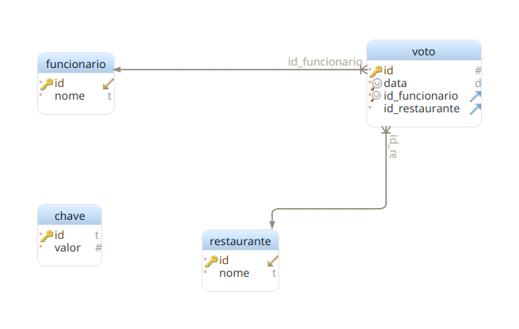

# Trabalho Final

### O problema
Os times de uma empresa enfrentam um grande problema. Como eles são muito democráticos, todos os dias eles gastam 30 minutos decidindo onde eles almoçarão. 
Vamos fazer um pequeno sistema que auxilie essa tomada de decisão!

### Requisitos do Sistema

O sistema deverá possibilitar:

- Cadastro de votos;
    - Um funcionário só pode votar uma vez por dia e em um restaurante apenas;
- Listar funcionários;
- Listar restaurantes;
- Apurar votação do dia.

### Instruções

1. O sistema deve ser construído utilizando como banco de dados o H2;
2. Utilize Gradle no projeto;
3. A camada de acesso a dados deve ser construída utilizando JPA;
4. Utilize MVC;
5. O código deve estar documentado com JavaDoc;
6. Utilize os conteudos da disciplina na implementação do trabalho;
7. O Sistema deve possuir um menu.

--- 
 

     IMPORTANTE: você deve desenvolver um sistema e não um simples exemplo de acesso a Banco de Dados utilizando JPA. Portanto, utilize a Orientação a Objetos e todas as técnicas aprendidas na disciplina até então (Collections, sobrecarga de métodos, herança, tratamento de exceções). Atenção as validações e erros. Lembre-se também aplicações não tem opções para criar modelo de dados, elas utilizam um.

     AVALIAÇÃO: o trabalho deve ser apresentado no dia 17/12. Onde deve ser apresentadas as funcionalidades implementadas e explicadas as decisões de construção. Funcionalidades que o aluno não souber explicar como fez não serão consideradas como feitas.

- *Trabalho individual. Implementações idênticas serão descontadas.*

## Modelo ER do Banco de Dados

---

# Script para criação do banco de dados:

    CREATE TABLE "PUBLIC".chave ( 
        id varchar(35) NOT NULL,
        valor integer NOT NULL,
        CONSTRAINT pk_chave_id PRIMARY KEY ( id )
     );
     
    CREATE TABLE "PUBLIC".funcionario ( 
        id integer NOT NULL,
        nome varchar(45) NOT NULL,
        CONSTRAINT pk_funcionario_id PRIMARY KEY ( id )
     );
     
    CREATE TABLE "PUBLIC".restaurante ( 
        id integer NOT NULL,
        nome varchar(45) NOT NULL,
        CONSTRAINT pk_restaurante_id PRIMARY KEY ( id )
     );
     
    CREATE TABLE "PUBLIC".voto ( 
        id integer NOT NULL,
        data date NOT NULL,
        id_funcionario integer NOT NULL,
        id_restaurante integer NOT NULL,
        CONSTRAINT pk_voto_id PRIMARY KEY ( id ),
        CONSTRAINT unq_voto_pessoa_data UNIQUE ( data, id_funcionario ) 
     );
     
    ALTER TABLE "PUBLIC".voto ADD CONSTRAINT fk_voto_restaurante FOREIGN KEY ( id_restaurante ) REFERENCES "PUBLIC".restaurante( id ) ON DELETE NO ACTION ON UPDATE NO ACTION;
    ALTER TABLE "PUBLIC".voto ADD CONSTRAINT fk_voto_funcionario FOREIGN KEY ( id_funcionario ) REFERENCES "PUBLIC".funcionario( id ) ON DELETE NO ACTION ON UPDATE NO ACTION;
